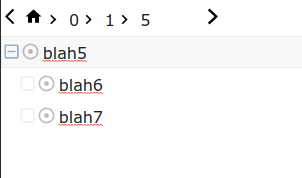

## Chkflow

---

Chkflow is meant to be an react component editor/view for tree and graph data structures inspired by workflowy's interface.



# Below is the **desired future** behavior

### Integrate it into your react project:
```sh
yarn add chkflow
```

or

```sh
npm install -S chkflow
```

### Usage:

To integrate Chkflow:

```javascript
import ChkFlow from 'chkflow'

const getNode = async id => await fetch('your-api/node/'+id).then(data => return data)

const settings = {
    getNodeCallback: getNode,

}

function MyComponent(props){

    /*** doing stuff ***/

    return (
        <div class="tree-container">
            <ChkFlow {...settings} />
        </div>
    )
}
```

With typescript:
```typescript
import ChkFlow, types as chktypes from 'chkflow'

const getNode = async id => await fetch('your-api/node/'+id).then(data => return data)

const settings = {
    getNodeCallback: getNode,

}

function MyComponent(props){

    /*** doing stuff ***/

    return (
        <div class="tree-container">
            <ChkFlow {...settings} />
        </div>
    )
}
```